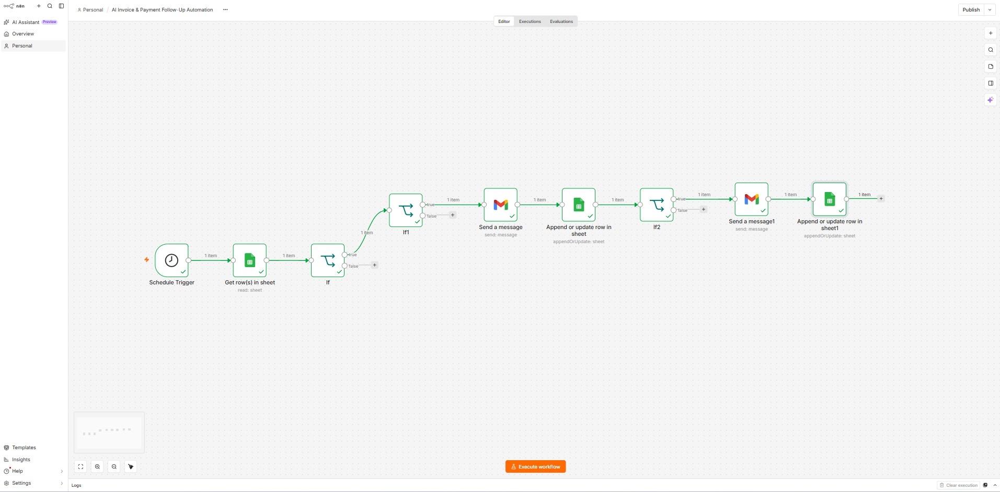
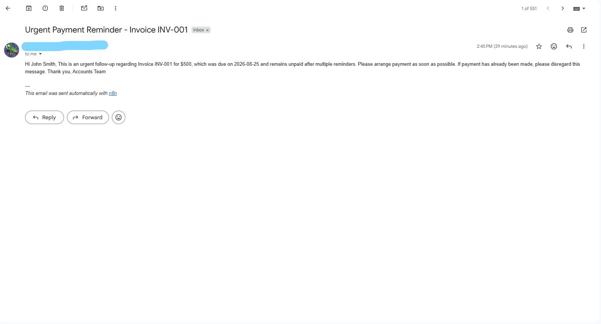
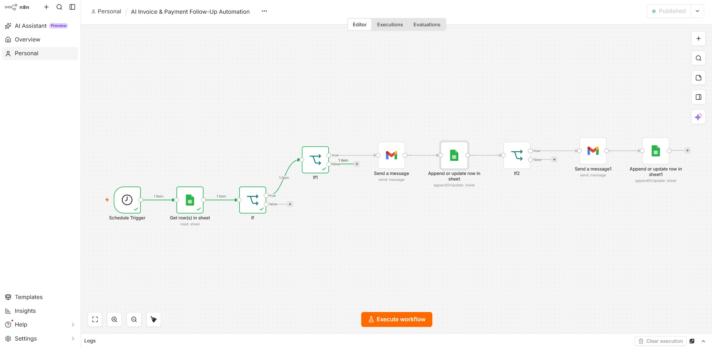

# AI Invoice & Payment Follow-Up Automation

An automated invoice payment tracking and follow-up system built with **n8n, Google Sheets, and Gmail**.

This workflow automatically detects overdue invoices, sends payment reminders, tracks reminder history, and escalates unpaid invoices after multiple follow-ups.

## Features

- Automatically checks invoice records on a schedule
- Detects overdue and unpaid invoices
- Prevents reminders from being sent too frequently
- Sends personalized payment reminder emails
- Updates the last reminder date automatically
- Tracks the number of reminders sent
- Escalates invoices after multiple reminders
- Sends an urgent payment follow-up email
- Records escalation status in Google Sheets
- Prevents duplicate escalation emails

## Workflow

1. Schedule Trigger starts the automation
2. Google Sheets retrieves invoice records
3. IF condition checks whether the invoice is unpaid and overdue
4. Reminder timing condition checks the last reminder date
5. Gmail sends a personalized payment reminder
6. Google Sheets updates the reminder date and reminder count
7. Escalation condition checks the reminder count and escalation status
8. Gmail sends an urgent payment reminder when escalation is required
9. Google Sheets marks the invoice as Escalated

## Tools Used

- n8n
- Google Sheets
- Gmail
- Workflow Conditions & Routing
- n8n Expressions

## Example Invoice Data

The workflow can track information such as:

- Invoice ID
- Client Name
- Client Email
- Invoice Amount
- Due Date
- Payment Status
- Last Reminder Date
- Reminder Count
- Escalation Status

## Business Use Cases

This automation can be used by:

- Freelancers
- Agencies
- Small businesses
- Consultants
- Accounting teams
- Service-based businesses

It reduces manual invoice follow-ups and helps businesses maintain a consistent payment collection process.

## Screenshots

### n8n Invoice Follow-Up Workflow

### Google Sheets Invoice Tracker

### Automated Urgent Payment Reminder

### Published n8n Automation

## Security

No API keys, passwords, OAuth tokens, or private credentials should be included in this repository. Replace test client information with sample data before using the workflow publicly.

## Author

**ZA AI Solutions**

AI Automation | n8n Workflows | API Integrations
